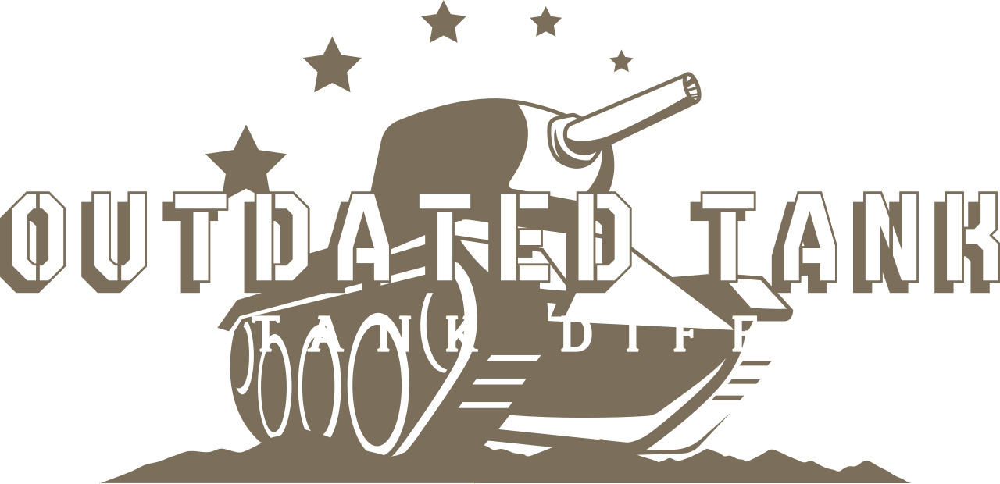
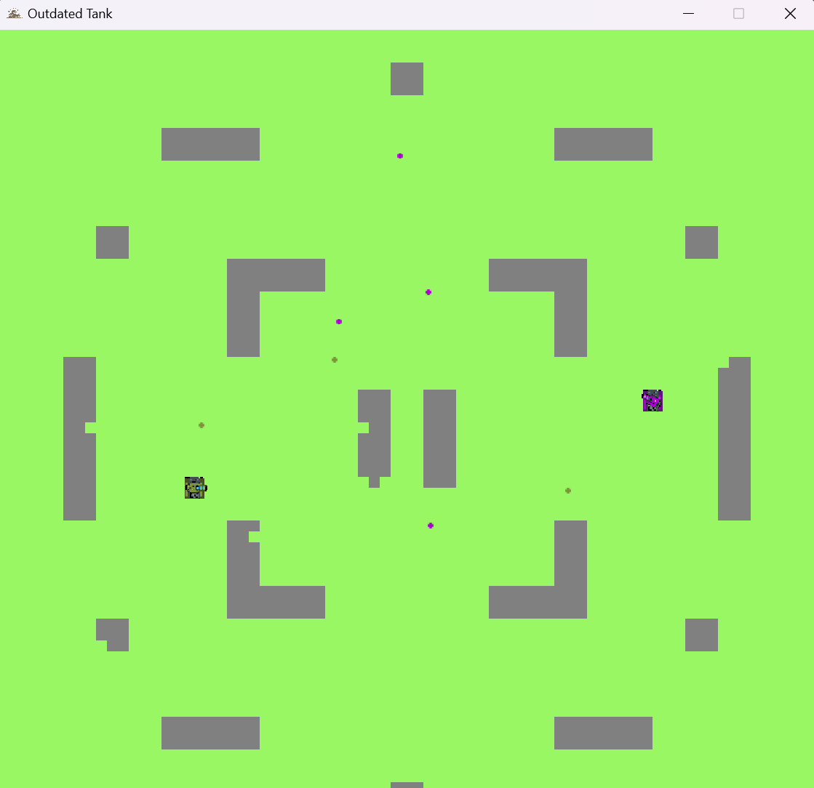
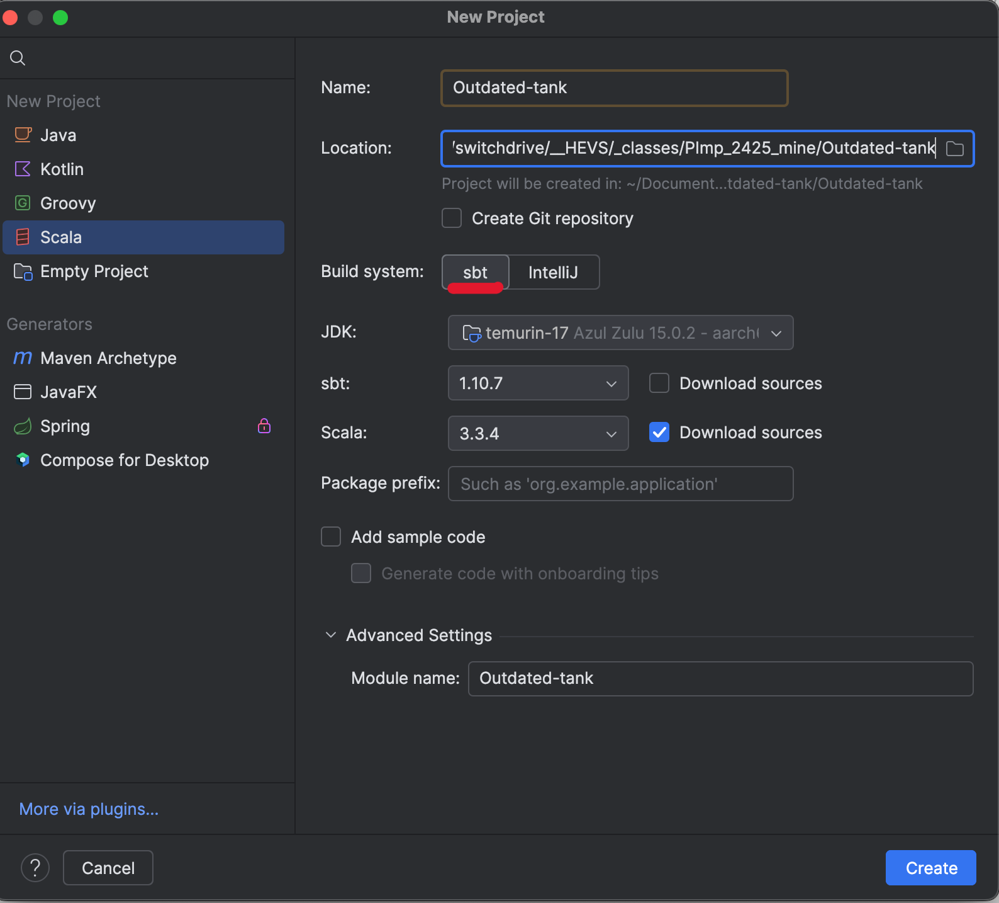

# Outdated Tank

Welcome to **Outdated Tank**, a 2D grid-based tank battle game written in **Scala**. 2 Players have a tank and have to destroy the one to dominate the battlefield.

## Concept

In **Outdated Tank**, players control tanks that fight for dominance on a grid-based battlefield. The game is simple but strategic:

- Each tank moves across a 2D grid, aiming to outwit and outshoot opponents.
- Firepower is unlimited, but you have a cooldown limit between each shot. Ammo can bounce on Wall!
- Destroy other tanks and claim the grid as your own!
- You can destroy the wall by rolling on game on your own ! You have multiple settings that you can customize.

it or shooting on hit

There is an [application.conf](./Outdated-tank/src/main/resources/application.conf) where you can balance your game on your own ! You have multiple settings that you can customize.

## Code Structure

The project is organized as follows:

1. **`Main.scala`**
   - Entry point of the game.

2. **`Game.scala`**
   - Manages the overall game logic.
   - Handles game states, player actions, and interactions between tanks.

3. **`Tank.scala`**
   - Defines the `Tank` class, representing the player and enemy tanks.
   - Key properties:
     - **Position**: Tracks the tank's current grid location.
     - **Direction**: The direction the tank is facing (e.g., up, down, left, right).
     - **Cooldown**: Manages the firing delay.

4. **`Grid.scala`**
   - Manages the grid-based battlefield.
   - Key functionalities:
     - Placement of tanks and obstacles.
     - Validating movements (e.g., preventing tanks from leaving the grid).

5. **`ammo.scala`**
   - Represents projectiles fired by tanks.
   - Handles movement and bounce effect.

and more...

## How to setup ?

1. **Clone the Repository**:
    - Clone the repository
    - Make sure you are on the develop branch

2. **Start the Project**:
    - Open IntelliJ
    - Select the sub-directory **Outdated-Tank** *NOT THE FIRST PROJECT DIRECTORY*
    - Compile it with **SBT** do not use IntelliJ system
    - Wait a few minutes... Some librairies are being downloaded

4. **Run the Game**:
    - Once all is set up. Start main